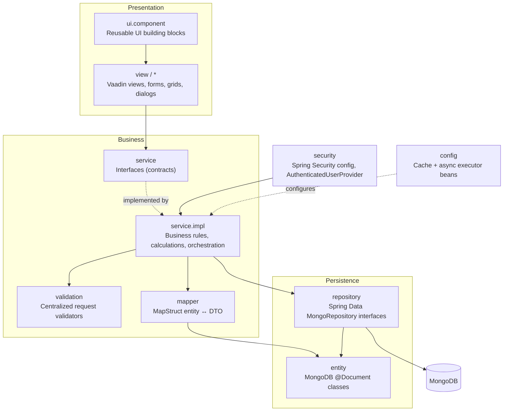
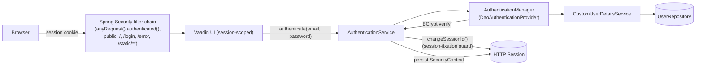
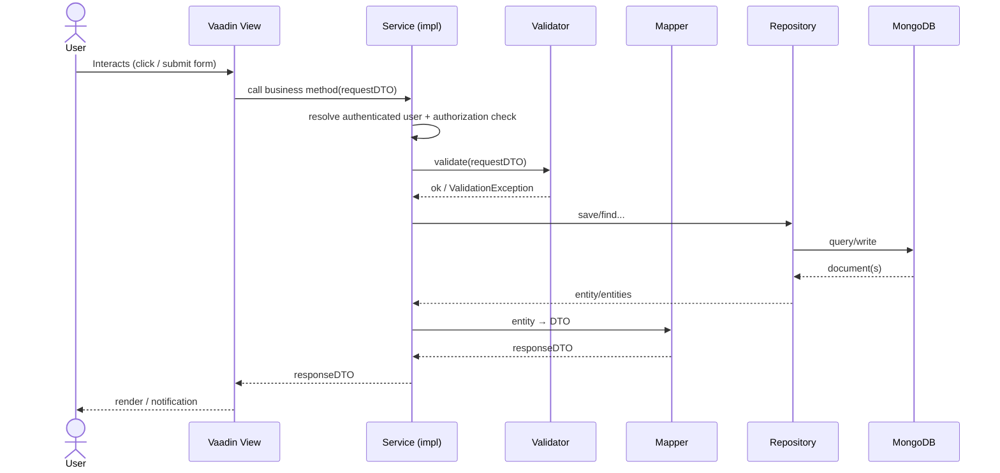

# Architecture

GymTracker follows a strict layered (clean) architecture on top of Spring Boot, with Vaadin as a server-side-rendered presentation layer. No layer may bypass the one below it, and dependencies only ever point downward.

## Package organization

```
src/main/java/com/gymtracker/
├── entity/       MongoDB @Document classes (User, Exercise, Mesocycle, NutritionPlan, Session, Alert)
├── repository/   Spring Data MongoRepository interfaces
├── service/      Business interfaces (contracts) + service/impl/ implementations
├── dto/          Data transfer objects, one subpackage per module (alert, athlete, auth, dashboard, exercise, fatigue, mesocycle, nutrition, user, workout)
├── mapper/       MapStruct entity ↔ DTO mappers
├── validation/   Centralized request/business-rule validators
├── exception/    Custom exceptions + GlobalExceptionHandler
├── security/     Spring Security config, CustomUserDetails, AuthenticatedUserProvider
├── config/       Cache (Caffeine) and async executor configuration
├── view/         Vaadin views, one subpackage per module, plus their view-local grids/forms/dialogs
└── ui/component/ Small, generic, reusable Vaadin components shared across every module
```

Each package carries a `package-info.java` stating its one-sentence responsibility — a quick way to confirm you're adding a new class in the right place.

## Clean Architecture



**Rule:** Views talk to Services only — never to Repositories or Entities directly. Services never reference Vaadin classes. Repositories never contain business logic.

**Allowed:** `View → Service → Repository → MongoDB`

**Forbidden:**
- `View → Repository` / `View → Entity` / `View → MongoDB`
- `Repository → Service` / `Repository → View`
- `Service → View`
- `Entity → Repository`

Every business rule (1RM estimation, fatigue scoring, mesocycle validation, alert generation, coach/nutritionist assignment checks) lives in `service.impl` — never in a view, repository, or entity.

## Package responsibilities

| Package | Responsibility | Must never |
|---|---|---|
| `entity` | One class per MongoDB collection: fields, Bean Validation constraints, `@Indexed`/`@CompoundIndex` annotations | Contain business calculations |
| `repository` | `MongoRepository<T, String>` interfaces with derived query methods (`findByAthleteId`, etc.) and the occasional `@Query` for cases derived methods can't express | Contain business logic |
| `service` | Interfaces declaring business operations (`MesocycleService`, `AlertService`, ...); Javadoc on the interface documents *who* may call each method | Contain implementation |
| `service.impl` | Business rules, authorization checks, calculations (1RM, fatigue), validator calls, repository orchestration, DTO conversion | Reference Vaadin/UI classes |
| `dto` | Data carried across the view ↔ service boundary (`*RequestDTO`, `*ResponseDTO`, `*SummaryDTO`, `*DetailDTO`) | Contain business logic |
| `mapper` | MapStruct interfaces (`componentModel="spring"`) converting entity ↔ DTO | Contain business logic |
| `validation` | One validator per aggregate, wrapping Bean Validation (`jakarta.validation.Validator`) plus cross-field rules | Be bypassed by services |
| `exception` | Custom exceptions (`ResourceNotFoundException`, `UnauthorizedOperationException`, `ValidationException`, `BusinessRuleException`, `DuplicateResourceException`, ...) and a `GlobalExceptionHandler` | — |
| `security` | `SecurityConfig`, `CustomUserDetailsService`, `CustomUserDetails`, `PasswordConfig`, `AuthenticatedUserProvider` | Leak `HttpServletRequest`/session details past the security package |
| `config` | `CacheConfig` (Caffeine-backed `CacheManager`), `AsyncConfig` (bounded `ThreadPoolTaskExecutor`) | Contain business logic |
| `view` | One subpackage per module (`athlete`, `exercise`, `mesocycle`, `workout`, `nutrition`, `alert`, `statistics`, `report`, `settings`, `dashboard`, `auth`, `layout`); `@Route` views plus their view-local grids/forms/dialogs | Call repositories or touch entities directly |
| `ui.component` | Small, generic, reusable Vaadin components shared across every module (`Toolbar`, `SearchBar`, `EmptyState`, `LoadingSpinner`, `StatCard`, `AlertCard`, `NotificationBadge`, `ConfirmDialog`, `Notifications`) | Contain business logic or module-specific knowledge |

## Service Layer

Every business capability is a **Service interface** in `service` with exactly one implementation in `service.impl` (constructor injection throughout, never field injection). Interfaces are Spring beans only through their implementation (`@Service`); there is no interface segregation beyond "one interface per capability."

Two shared, cross-cutting collaborators are injected into most service implementations to avoid duplicating the same logic across every service:

- **`AuthenticatedUserProvider`** (`security` package) — resolves the authenticated `User` entity from `SecurityContextHolder` (extracting the principal's email, then loading the `User` by email). Before this was centralized, nearly every `*ServiceImpl` duplicated the same `getAuthenticatedUser()`/`extractAuthenticatedEmail()` pair; now they all delegate to this one component. `ExerciseServiceImpl` is the only service with genuinely different needs (it only needs the caller's email and whether they hold the `ROLE_COACH` authority, not a full `User` load) and uses the provider's lower-level `requireAuthentication()`/`extractEmail(Authentication)` methods directly instead of the full `getAuthenticatedUser()`. `StatisticsServiceImpl` keeps its own, deliberately different implementation (a direct unchecked cast to `UserDetails`) rather than being migrated, since its behavior differs subtly and migrating it was judged not worth the behavior-change risk.
- **`AthleteAssignmentService`** (`service`/`service.impl`) — the single source of truth for "is this athlete assigned to this coach/nutritionist?" A coach is assigned to an athlete if the coach has created at least one `Mesocycle` for them; a nutritionist is assigned if they have created at least one `NutritionPlan` for them. `AlertService`, `AthleteService`, `MesocycleService`, `NutritionPlanService`, `ReportService`, `StatisticsService` and `WorkoutSessionService` all call into this rather than each re-implementing the same `mesocycleRepository.findByCoachId(...).stream().anyMatch(...)` query.

Every service method that exposes or mutates data belonging to another user re-derives the authenticated user and re-checks role + assignment on every call — there is no assumption that a prior check (e.g., in the view) already ran. See [Authorization model](#authorization-model) below and the per-method breakdown in [API.md](API.md).

`FatigueService` and `OneRepMaxService` are the two exceptions: neither has any authorization check in its implementation (any authenticated user can call either for any `athleteId`). Both are only ever reached, in practice, through views/services that already enforce a check before calling them (e.g. `DashboardService`, `ReportService`) — but there is no defense-in-depth at their own layer. This is a known, documented gap, not an oversight to silently work around; see [API.md](API.md#cross-cutting-notes).

## Repository Layer

Every repository extends `MongoRepository<T, String>` (Spring Data converts the `String` id to/from the entity's `ObjectId @Id` field automatically) and exposes **derived query methods** (`findByAthleteId`, `findByCoachId`, `findByAthleteIdAndStatus`, ...) rather than hand-written queries wherever the method name alone can express the filter. Two exceptions in `NutritionPlanRepository` use `@Query` because the desired method name doesn't match the underlying field name (`findByStatus(Boolean)` → `{ 'active': ?0 }`; `findByNutritionGoal(NutritionGoal)` → `{ 'goal': ?0 }`, since there's no literal `nutritionGoal` field).

Repositories contain **zero business logic** — no role checks, no calculations, no cross-entity orchestration. That all lives in `service.impl`, which composes one or more repository calls plus `AthleteAssignmentService`/`AuthenticatedUserProvider` to answer a business question. See [DATABASE.md](DATABASE.md) for the full collection/field/index reference and how each derived query lines up with a declared index.

## DTOs

DTOs are the only objects that cross the View↔Service boundary — a view never receives or sends an entity. Naming is consistent across every module:

| Suffix | Purpose | Direction |
|---|---|---|
| `*RequestDTO` | Create/update payload from a view form | View → Service |
| `*ResponseDTO` | Full result of a create/update/single-item read | Service → View |
| `*SummaryDTO` | Lightweight row shape for grids/lists (fewer fields than Detail) | Service → View |
| `*DetailDTO` | Full single-item shape for detail dialogs/pages | Service → View |

Not every module has all four — e.g. `AlertDTO`/`AlertSummaryDTO` (alerts are read-mostly, no request DTO since alerts are system-generated), `FatigueDTO`, `ChartDTO`/`DashboardDTO`/`ProgressDTO`/`ReportDTO`/`StatisticsDTO` (dashboard module, read-only aggregates), `AuthenticatedUserDTO` (auth module). See [API.md](API.md) for the exact DTOs used by every service method.

## Mappers

MapStruct interfaces (one per entity/module) generate the entity ↔ DTO conversion code at compile time — no hand-written mapping code, no reflection at runtime. All mappers share one configuration, `MapStructConfig`:

```java
@MapperConfig(
    componentModel = "spring",
    nullValuePropertyMappingStrategy = NullValuePropertyMappingStrategy.IGNORE,
    unmappedTargetPolicy = ReportingPolicy.IGNORE
)
```

`componentModel = "spring"` makes every generated mapper a Spring bean (constructor-injectable into `service.impl` like any other collaborator). `ObjectIdMapper` is a small shared helper (used by every other mapper) converting between MongoDB's `ObjectId` and the `String` representation DTOs use. In tests, mappers are instantiated directly (`new XxxMapperImpl()`) with `ObjectIdMapper` wired in via `ReflectionTestUtils.setField(...)`, rather than mocked — exercising the real generated mapping logic.

## Validators

One validator class per aggregate (`AlertValidator`, `AthleteValidator`, `ExerciseValidator`, `MesocycleValidator`, `NutritionPlanValidator`, `UserValidator`, `WorkoutValidator`), all extending a shared `BaseValidator`:

```java
public abstract class BaseValidator {
    protected <T> void validateBean(T target, Function<String, ? extends RuntimeException> exceptionFactory);
    protected void requireCondition(boolean condition, String message, Function<String, ? extends RuntimeException> exFactory);
    protected boolean hasText(String value);
}
```

`validateBean` runs the request DTO through Jakarta Bean Validation (`jakarta.validation.Validator`, injected — not the static `Validation.buildDefaultValidatorFactory()` in production code, only in tests) and collects every constraint violation into one exception message, rather than failing on the first violation. `requireCondition` covers validation that can't be expressed as a bean-validation annotation (e.g. "end date must be after start date", "no duplicate plan for the same period/goal"). Each validator throws its own module-specific exception subtype (e.g. `MesocycleValidationException`) via the exception-factory function passed in, so callers get a precise, catchable exception type per module while sharing the actual checking logic.

## Spring Security



Key points:
- **No REST/MVC controllers exist** that serve application functionality. Every screen is a Vaadin view; Spring Security's CSRF filter is disabled because Vaadin Flow has its own built-in CSRF/XSRF token validation for its internal UIDL protocol, and there is no separate form/REST surface that would need Spring's filter.
- **Manual authentication.** `LoginView` never uses Spring's `UsernamePasswordAuthenticationFilter` POST endpoint; it calls `AuthenticationService.authenticate(email, password)`, which invokes the `AuthenticationManager` directly, then manually persists the resulting `SecurityContext` into the HTTP session via `HttpSessionSecurityContextRepository` and rotates the session ID (`HttpServletRequest.changeSessionId()`) to prevent session fixation.
- **Passwords** are hashed with `BCryptPasswordEncoder` (`PasswordConfig`) and never logged or exposed in any DTO.
- **Route protection**: `SecurityConstants.PUBLIC_ROUTES` (`/`, `/login`, `/error`, `/static/**`) are the only `permitAll()` routes; `.anyRequest().authenticated()` covers everything else. No view class carries `@RolesAllowed`/`@PermitAll` — role restriction is enforced inside each view (redirecting away if the role doesn't match) and, authoritatively, inside the service layer.

### Authorization model

Authorization is enforced in the **service layer**, not the view layer — every `service.impl` method that returns or mutates another user's data re-derives the authenticated user via `AuthenticatedUserProvider` and checks role + relationship:

- **Athletes** may only access their own data.
- **Coaches** may only access data for athletes actually assigned to them (`AthleteAssignmentService.isAthleteAssignedToCoach` — has a mesocycle with that coach).
- **Nutritionists** may only access data for athletes actually assigned to them (`AthleteAssignmentService.isAthleteAssignedToNutritionist` — has a nutrition plan with that nutritionist).

Views additionally hide/redirect based on role for UX, but that is a convenience layer only — the service layer is the actual security boundary and enforces the same rule even if a view were bypassed. See [API.md](API.md) for the exact authorization rule enforced by every single service method.

### Error handling note

`GlobalExceptionHandler` (`@RestControllerAdvice`) maps each custom exception to an HTTP status and an `ErrorResponseDTO` — but since the application defines no `@Controller`/`@RestController` endpoints, this advice is never actually invoked in practice; it would only fire for hypothetical future REST endpoints. In the running application today, exceptions thrown by a service (`ValidationException`, `BusinessRuleException`, `UnauthorizedOperationException`, `ResourceNotFoundException`, `DuplicateResourceException`, ...) propagate synchronously back up to the calling **Vaadin view**, which catches them directly and shows a `Notification` (via the shared `ui.component.Notifications` helper) — see the request-flow diagram below.

## Spring Events

**Not used.** GymTracker does not publish or listen for any Spring `ApplicationEvent`s (`ApplicationEventPublisher`, `@EventListener`, `@TransactionalEventListener` do not appear anywhere in the codebase). Cross-service side effects (e.g., logging a workout session triggers 1RM recalculation, fatigue recalculation, and several alert-generation calls) are wired as **direct synchronous/asynchronous method calls** from `WorkoutSessionServiceImpl` into `OneRepMaxService`/`FatigueService`/`AlertService`, not through an event bus. If a future change wants to decouple these side effects further, Spring's `ApplicationEventPublisher` would be the natural mechanism — but that is a suggestion for future work, not current behavior.

## Spring Cache

`CacheConfig` replaces Spring Boot's default `ConcurrentMapCacheManager` (which never expires or bounds entries) with a **Caffeine**-backed `CacheManager`:

```java
CaffeineCacheManager(DASHBOARD_CACHE /* "dashboards" */, STATISTICS_CACHE /* "statistics" */)
    .setCaffeine(Caffeine.newBuilder().maximumSize(2_000).expireAfterWrite(10, TimeUnit.MINUTES));
```

- `dashboards` — `DashboardServiceImpl`'s four `get*Dashboard` methods are `@Cacheable`, keyed per user (`'ATHLETE:' + #athleteId`, `'COACH:' + #coachId`, etc.). Any write anywhere in the app that could change a dashboard's numbers (creating/updating a mesocycle, nutrition plan, workout session, or alert) evicts the whole `dashboards` cache (`@CacheEvict(allEntries = true)`, several `beforeInvocation = true` so the eviction happens even if the write itself later fails) rather than trying to invalidate a single precise key.
- `statistics` — `StatisticsServiceImpl`'s `get*Statistics`/`get*Chart` methods are `@Cacheable`, keyed similarly per user/scope. This service uses a self-injected proxy (`@Lazy StatisticsServiceImpl self`) so that the **permission check always runs before the cached method is reached** — the public `get*` method checks authorization, then calls `self.compute*(...)`, which is the actual `@Cacheable` method. Calling `compute*` directly (bypassing `self`) would skip the permission check entirely on a cache hit, which is exactly why the indirection exists.

Because of the 10-minute TTL, dashboard/statistics reads can be up to 10 minutes stale relative to the underlying MongoDB documents in the (rare) case an eviction is missed — in practice every relevant write path evicts `dashboards`, so staleness is bounded by the explicit eviction calls, not by the TTL, under normal operation.

## Async processing

`AsyncConfig` replaces Spring's default `SimpleAsyncTaskExecutor` (unbounded, spawns a new thread per call) with a bounded `ThreadPoolTaskExecutor`:

```java
core = 4, max = 16, queueCapacity = 200, threadNamePrefix = "gymtracker-async-"
```

`@Async` methods, all returning `CompletableFuture<T>`, run on this pool:

- `AlertServiceImpl` — all five `generate*Alert` methods (fatigue, missed workout, nutrition-plan-expired, mesocycle-completed, performance-drop)
- `FatigueServiceImpl.calculateFatigue`
- `OneRepMaxServiceImpl.calculateOneRepMax`
- `ReportServiceImpl.exportReport` (PDF/XLSX generation)

`WorkoutSessionServiceImpl.createWorkoutSession` fires several of these asynchronously (1RM recalculation, fatigue recalculation, alert generation) after persisting the session, so the athlete's "finish workout" action returns promptly while the derived calculations happen in the background. Since the app has no Vaadin `@Push` configured, views that need to show a result produced on a background thread (e.g. the report export dialog) temporarily enable UI polling (`UI.setPollInterval`) while waiting rather than push updates.

## Request flow



No step is skipped: a view never reads a Mongo document directly, and a repository never returns anything to a view. If a step fails (validation, authorization, not-found), the exception propagates directly back to the view, which catches it and renders a `Notification` — see [Error handling note](#error-handling-note) above.

## Module map

Each business capability is a **view subpackage** on top of a **service** with one implementation:

| Module | Service | View package | Primary role(s) |
|---|---|---|---|
| Dashboard | `DashboardService` | `view.dashboard` | All (role-specific dashboard) |
| Authentication | `AuthenticationService` | `view.auth` | Public |
| Athlete management | `AthleteService` | `view.athlete` | Coach, Nutritionist (list/detail, assigned only) · Athlete (own profile) |
| Exercise catalog | `ExerciseService` | `view.exercise` | Coach (write) · all (read) |
| Mesocycle (training program) | `MesocycleService` | `view.mesocycle` | Coach (write, own only) · Athlete/Nutritionist (read, own/assigned only) |
| Workout logging & history | `WorkoutSessionService`, `OneRepMaxService`, `FatigueService` | `view.workout` | Athlete (write, own only) · Coach/Nutritionist (read, assigned only) |
| Nutrition plans | `NutritionPlanService` | `view.nutrition` | Nutritionist (write, own only) · Athlete/Coach (read, own/assigned only) |
| Alerts | `AlertService` | `view.alert` | Coach (acknowledge/resolve, own only) · Athlete/Nutritionist (read, own/assigned only) |
| Statistics | `StatisticsService` | `view.statistics` | All (own/assigned scope) |
| Reports | `ReportService` | `view.report` | All (generate + async export to PDF/XLSX) |
| Settings / profile | `UserService` | `view.settings` | All (self only) |
| Coach/nutritionist assignment | `AthleteAssignmentService` | — (no view; internal collaborator) | Used by the services above, not called directly from any view |

See [API.md](API.md) for the full method-by-method contract of every service in this table.

## Testing architecture

| Test type | Tooling | What it covers |
|---|---|---|
| Repository tests | `@DataMongoTest` against a real local `gymtracker_test` database | Index behavior, derived queries, `@Query` methods |
| Service tests | JUnit 5 + Mockito, real MapStruct mapper + real Bean Validation validator, mocked repositories | Business rules, authorization, calculations |
| Security tests | `TestingAuthenticationToken` simulating `SecurityContextHolder` state | Role/assignment-based authorization paths |
| Integration test | `@SpringBootTest` (`GymTrackerApplicationIntegrationTest`) against a real MongoDB | Full application context loads correctly |
| Coverage | JaCoCo | HTML report at `target/site/jacoco/index.html` after `./mvnw test` |

Full instructions in [DEVELOPER_GUIDE.md](DEVELOPER_GUIDE.md#testing).
