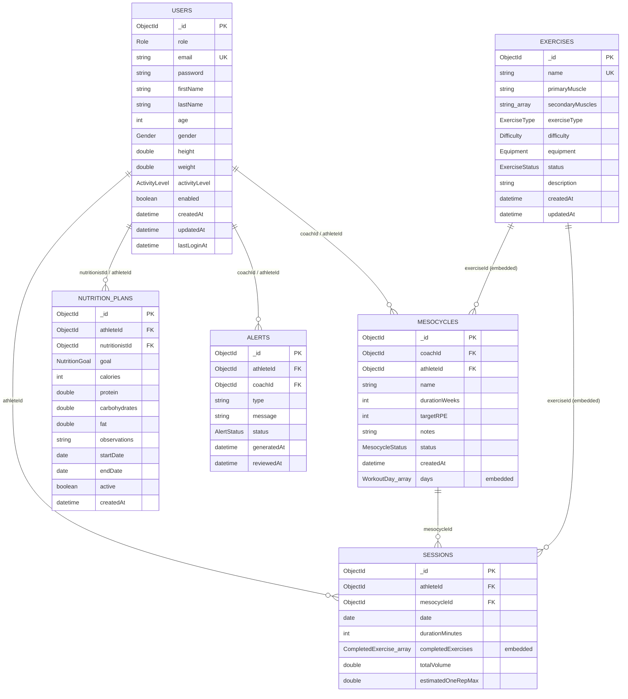

# Database

GymTracker persists to a single MongoDB database (default name `gymtracker`, configured via `spring.data.mongodb.uri` / `spring.data.mongodb.database`, both overridable by environment variable — see [DEPLOYMENT.md](DEPLOYMENT.md#environment-variables)) with **six collections**. References between collections are plain `ObjectId` fields (no `@DBRef` anywhere in the codebase); small, always-together structures (sets, training days, planned exercises) are **embedded documents** rather than separate collections. There is no programmatic index bootstrapping (no `MongoTemplate`/`IndexOperations` code) — every index below is declared purely via annotations (`@Indexed`, `@CompoundIndex`/`@CompoundIndexes`) on the entity classes, and created automatically by Spring Data MongoDB on startup.

## Entity-relationship overview

## Collections

### `users`

| Field | Type | Constraints |
|---|---|---|
| `_id` | `ObjectId` | primary key |
| `role` | `Role` enum (`ATHLETE`, `COACH`, `NUTRITIONIST`) | `@NotNull`, indexed |
| `email` | `String` | `@NotBlank @Email`, **unique index** |
| `password` | `String` | `@NotBlank` — BCrypt hash, never plaintext |
| `firstName` | `String` | `@NotBlank` |
| `lastName` | `String` | `@NotBlank` |
| `age` | `Integer` | `@Min(14) @Max(100)` |
| `gender` | `Gender` enum (`MALE`, `FEMALE`, `OTHER`, `PREFER_NOT_TO_SAY`) | — |
| `height` | `Double` | `@Positive` |
| `weight` | `Double` | `@Positive` |
| `activityLevel` | `ActivityLevel` enum (`SEDENTARY`…`VERY_ACTIVE`) | — |
| `enabled` | `Boolean` | `@NotNull` |
| `createdAt` / `updatedAt` | `LocalDateTime` | `@NotNull` |
| `lastLoginAt` | `LocalDateTime` | nullable |

Indexes: `role` (single-field), `email` (single-field, **unique**).

### `exercises`

| Field | Type | Constraints |
|---|---|---|
| `_id` | `ObjectId` | primary key |
| `name` | `String` | `@NotBlank`, **unique index** |
| `primaryMuscle` | `String` | `@NotBlank`, indexed |
| `secondaryMuscles` | `List<String>` | `@NotEmpty` |
| `exerciseType` | `ExerciseType` enum (`STRENGTH`, `CARDIO`, `BODYWEIGHT`, `MOBILITY`) | `@NotNull`, indexed |
| `difficulty` | `Difficulty` enum (`BEGINNER`, `INTERMEDIATE`, `ADVANCED`) | `@NotNull`, indexed |
| `equipment` | `Equipment` enum (`BARBELL`, `DUMBBELL`, `MACHINE`, `BODYWEIGHT`, `CABLE`, `SMITH_MACHINE`, `KETTLEBELL`, `OTHER`) | `@NotNull`, indexed |
| `status` | `ExerciseStatus` enum (`ACTIVE`, `INACTIVE`) | `@NotNull`, indexed |
| `description` | `String` | `@NotBlank` |
| `createdAt` / `updatedAt` | `LocalDateTime` | `@NotNull` |

Indexes: 6 single-field indexes — `name` (unique), `primaryMuscle`, `exerciseType`, `difficulty`, `equipment`, `status`. The catalog is referenced by id from `Mesocycle`/`Session` embedded documents; it is never embedded itself.

### `mesocycles`

| Field | Type | Constraints |
|---|---|---|
| `_id` | `ObjectId` | primary key |
| `coachId` | `ObjectId` | `@NotNull`, indexed — references `users._id` |
| `athleteId` | `ObjectId` | `@NotNull`, indexed — references `users._id` |
| `name` | `String` | `@NotBlank` |
| `durationWeeks` | `Integer` | `@NotNull @Positive` |
| `targetRPE` | `Integer` | `@NotNull @Min(1) @Max(10)` |
| `notes` | `String` | nullable |
| `status` | `MesocycleStatus` enum (`DRAFT`, `ACTIVE`, `COMPLETED`, `ARCHIVED`) | `@NotNull`, indexed |
| `createdAt` | `LocalDateTime` | `@NotNull` |
| `days` | `List<WorkoutDay>` (embedded) | `@NotEmpty @Valid` |

**Embedded `WorkoutDay`:** `dayName: String (@NotBlank)`, `exercises: List<WorkoutExercise> (@NotEmpty @Valid)`.
**Embedded `WorkoutExercise`:** `exerciseId: ObjectId (@NotNull, references exercises._id)`, `sets: Integer (@NotNull @Positive)`, `repetitions: Integer (@NotNull @Positive)`, `targetWeight: Double (@NotNull @PositiveOrZero)`, `targetRPE: Integer (@NotNull @Min(1) @Max(10))`.

Compound indexes: `{ athleteId: 1, status: 1 }`, `{ coachId: 1, status: 1 }` — sized to match the two most common lookups: "an athlete's active mesocycle" and "a coach's active mesocycles."

### `nutritionPlans`

*(collection name is camelCase, the one exception to the otherwise plural-lowercase naming convention)*

| Field | Type | Constraints |
|---|---|---|
| `_id` | `ObjectId` | primary key |
| `athleteId` | `ObjectId` | `@NotNull`, indexed — references `users._id` |
| `nutritionistId` | `ObjectId` | `@NotNull`, indexed — references `users._id` |
| `goal` | `NutritionGoal` enum (`CUTTING`, `MAINTENANCE`, `BULKING`) | `@NotNull` |
| `calories` | `Integer` | `@NotNull @Positive` |
| `protein` / `carbohydrates` / `fat` | `Double` | `@NotNull @PositiveOrZero` |
| `observations` | `String` | `@Size(max = 500)`, nullable |
| `startDate` / `endDate` | `LocalDate` | `@NotNull` |
| `active` | `Boolean` | `@NotNull`, indexed |
| `createdAt` | `LocalDateTime` | `@NotNull` |

Compound indexes: `{ athleteId: 1, active: 1 }`, `{ nutritionistId: 1, active: 1 }` — matching the business rule that an athlete has at most one active plan at a time.

### `sessions`

| Field | Type | Constraints |
|---|---|---|
| `_id` | `ObjectId` | primary key |
| `athleteId` | `ObjectId` | `@NotNull`, indexed — references `users._id` |
| `mesocycleId` | `ObjectId` | `@NotNull`, indexed — references `mesocycles._id` |
| `date` | `LocalDate` | `@NotNull`, indexed |
| `durationMinutes` | `Integer` | `@NotNull @Positive` |
| `completedExercises` | `List<CompletedExercise>` (embedded) | `@NotEmpty @Valid` |
| `totalVolume` | `Double` | `@NotNull @Positive` |
| `estimatedOneRepMax` | `Double` | `@NotNull @Positive` |

**Embedded `CompletedExercise`:** `exerciseId: ObjectId (@NotNull, references exercises._id)`, `sets: List<CompletedSet> (@NotEmpty @Valid)`.
**Embedded `CompletedSet`:** `weight: Double (@NotNull @Positive)`, `repetitions: Integer (@NotNull @Positive)`, `rpe: Integer (@NotNull @Min(1) @Max(10))`.

Compound index: `{ athleteId: 1, date: 1 }` — matches the common query shape of an athlete's sessions filtered/sorted by date (history views, weekly/monthly volume aggregation).

### `alerts`

| Field | Type | Constraints |
|---|---|---|
| `_id` | `ObjectId` | primary key |
| `athleteId` | `ObjectId` | `@NotNull`, indexed — references `users._id` |
| `coachId` | `ObjectId` | `@NotNull`, indexed — references `users._id` |
| `type` | `String` | `@NotBlank` — one of `HIGH_FATIGUE`, `CRITICAL_FATIGUE`, `MISSED_WORKOUT`, `NUTRITION_PLAN_EXPIRED`, `MESOCYCLE_COMPLETED`, `PERFORMANCE_DROP`, `RECOVERY_RECOMMENDED` (not a Mongo enum constraint — validated in `AlertValidator`/generation code, stored as a plain string) |
| `message` | `String` | `@NotBlank` |
| `status` | `AlertStatus` enum (`ACTIVE`, `ACKNOWLEDGED`, `RESOLVED`) | `@NotNull`, indexed |
| `generatedAt` | `LocalDateTime` | `@NotNull` |
| `reviewedAt` | `LocalDateTime` | nullable, set when acknowledged/resolved |

Compound indexes: `{ athleteId: 1, status: 1 }`, `{ athleteId: 1, type: 1, status: 1 }` (duplicate-active-alert checks filter by exactly these three fields), `{ coachId: 1, status: 1 }`.

## Relationships

All relationships are **manual references** (plain `ObjectId` fields resolved in the service layer via `UserRepository`/`MesocycleRepository`/etc.) — MongoDB does not enforce referential integrity itself; that is the service/validator layer's responsibility (e.g. `getAthleteById`/`getCoachById` helpers in every `*ServiceImpl` verify the referenced user actually has the expected `role`).

| From | Field | To | Cardinality |
|---|---|---|---|
| `mesocycles` | `coachId` | `users._id` | many mesocycles → one coach |
| `mesocycles` | `athleteId` | `users._id` | many mesocycles → one athlete |
| `mesocycles.days[].exercises[].exerciseId` | (embedded) | `exercises._id` | many references → one exercise |
| `nutritionPlans` | `athleteId` | `users._id` | many plans → one athlete |
| `nutritionPlans` | `nutritionistId` | `users._id` | many plans → one nutritionist |
| `sessions` | `athleteId` | `users._id` | many sessions → one athlete |
| `sessions` | `mesocycleId` | `mesocycles._id` | many sessions → one mesocycle |
| `sessions.completedExercises[].exerciseId` | (embedded) | `exercises._id` | many references → one exercise |
| `alerts` | `athleteId` | `users._id` | many alerts → one athlete |
| `alerts` | `coachId` | `users._id` | many alerts → one coach |

**Coach/athlete and nutritionist/athlete "assignment"** is *derived*, not a stored relationship field: a coach is considered assigned to an athlete if a `mesocycles` document exists with that `coachId`/`athleteId` pair; a nutritionist is assigned if a `nutritionPlans` document exists with that `nutritionistId`/`athleteId` pair. This is computed on demand by `AthleteAssignmentService` (see [ARCHITECTURE.md](ARCHITECTURE.md#service-layer)) — there is no separate `assignments` collection.

## Indexes

| Collection | Index | Fields | Unique |
|---|---|---|---|
| `users` | single | `role` | no |
| `users` | single | `email` | **yes** |
| `exercises` | single | `name` | **yes** |
| `exercises` | single | `primaryMuscle` | no |
| `exercises` | single | `exerciseType` | no |
| `exercises` | single | `difficulty` | no |
| `exercises` | single | `equipment` | no |
| `exercises` | single | `status` | no |
| `mesocycles` | single | `coachId` | no |
| `mesocycles` | single | `athleteId` | no |
| `mesocycles` | single | `status` | no |
| `mesocycles` | compound | `{ athleteId, status }` | no |
| `mesocycles` | compound | `{ coachId, status }` | no |
| `nutritionPlans` | single | `athleteId` | no |
| `nutritionPlans` | single | `nutritionistId` | no |
| `nutritionPlans` | single | `active` | no |
| `nutritionPlans` | compound | `{ athleteId, active }` | no |
| `nutritionPlans` | compound | `{ nutritionistId, active }` | no |
| `sessions` | single | `athleteId` | no |
| `sessions` | single | `mesocycleId` | no |
| `sessions` | single | `date` | no |
| `sessions` | compound | `{ athleteId, date }` | no |
| `alerts` | single | `athleteId` | no |
| `alerts` | single | `coachId` | no |
| `alerts` | single | `status` | no |
| `alerts` | compound | `{ athleteId, status }` | no |
| `alerts` | compound | `{ athleteId, type, status }` | no |
| `alerts` | compound | `{ coachId, status }` | no |

Every derived query method in the repository layer (`findByAthleteId`, `findByCoachId`, `findByAthleteIdAndStatus`, `findByAthleteIdAndTypeAndStatus`, etc. — see [ARCHITECTURE.md](ARCHITECTURE.md#repository-layer)) has a matching single-field or compound index; none of the indexes above were added speculatively.

## Validation rules

Two layers of validation apply to every write:

1. **Bean Validation** (`jakarta.validation` annotations shown in the tables above) — enforced both on the entity (defense in depth) and, primarily, on the corresponding `*RequestDTO` by each module's `*Validator` (see [ARCHITECTURE.md](ARCHITECTURE.md#validators)).
2. **Business rules**, enforced in `service.impl`, that cannot be expressed as field-level constraints:
   - **Uniqueness**: `users.email`, `exercises.name` — enforced by both a unique Mongo index (last line of defense) and an explicit existence check before insert/update (so the application can raise a clean `DuplicateResourceException` instead of surfacing a raw Mongo duplicate-key error).
   - **Referenced-role checks**: any `coachId` must reference a `User` with `role = COACH`; `athleteId` → `role = ATHLETE`; `nutritionistId` → `role = NUTRITIONIST`. Not enforced by MongoDB — checked in `service.impl` (e.g. `getAthleteById`, `getCoachById`, `getNutritionistById` helpers) on every read/write that resolves one of these ids.
   - **One active nutrition plan per athlete**: creating/activating a plan deactivates any other active plan for the same athlete first.
   - **Mesocycle exercise integrity**: every `exerciseId` referenced in a mesocycle's `days[].exercises[]` (and a session's `completedExercises[]`) must exist in the `exercises` collection; a session's completed exercises must belong to the mesocycle it's logged against.
   - **Alert deduplication**: a new alert of a given `type` is not created for an athlete while an existing `ACTIVE` alert of that same type already exists (`findByAthleteIdAndTypeAndStatus`).
   - **Archived/immutable state**: an `ARCHIVED` mesocycle cannot be updated; a `RESOLVED` alert is never deleted (`AlertService.deleteResolvedAlerts()` always throws — resolved alerts are permanent history).

## Caching and data freshness

`DashboardServiceImpl` and `StatisticsServiceImpl` cache their read methods (Caffeine, 10-minute TTL — see [ARCHITECTURE.md](ARCHITECTURE.md#spring-cache)). Every write path that could change a cached figure evicts the relevant cache, so in normal operation the cache reflects the latest write immediately; the 10-minute TTL is a safety bound, not the primary consistency mechanism. `AlertServiceImpl.generate*Alert`, `FatigueServiceImpl.calculateFatigue` and `OneRepMaxServiceImpl.calculateOneRepMax` run asynchronously (`@Async`, bounded thread pool — see [ARCHITECTURE.md](ARCHITECTURE.md#async-processing)), so a small delay between "workout logged" and "alert/1RM/fatigue document written" is expected and by design.
