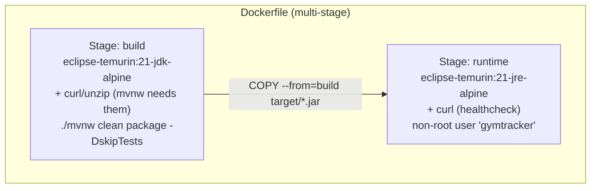
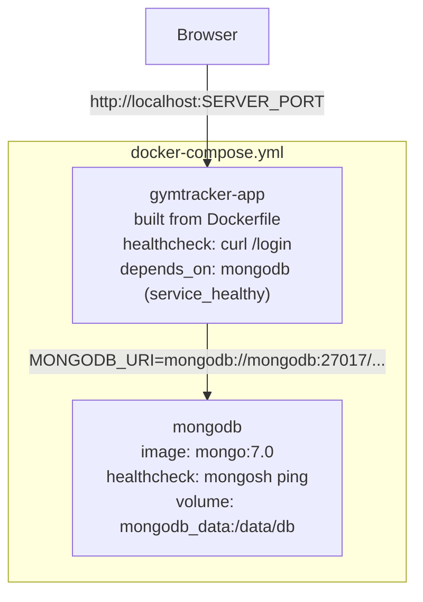
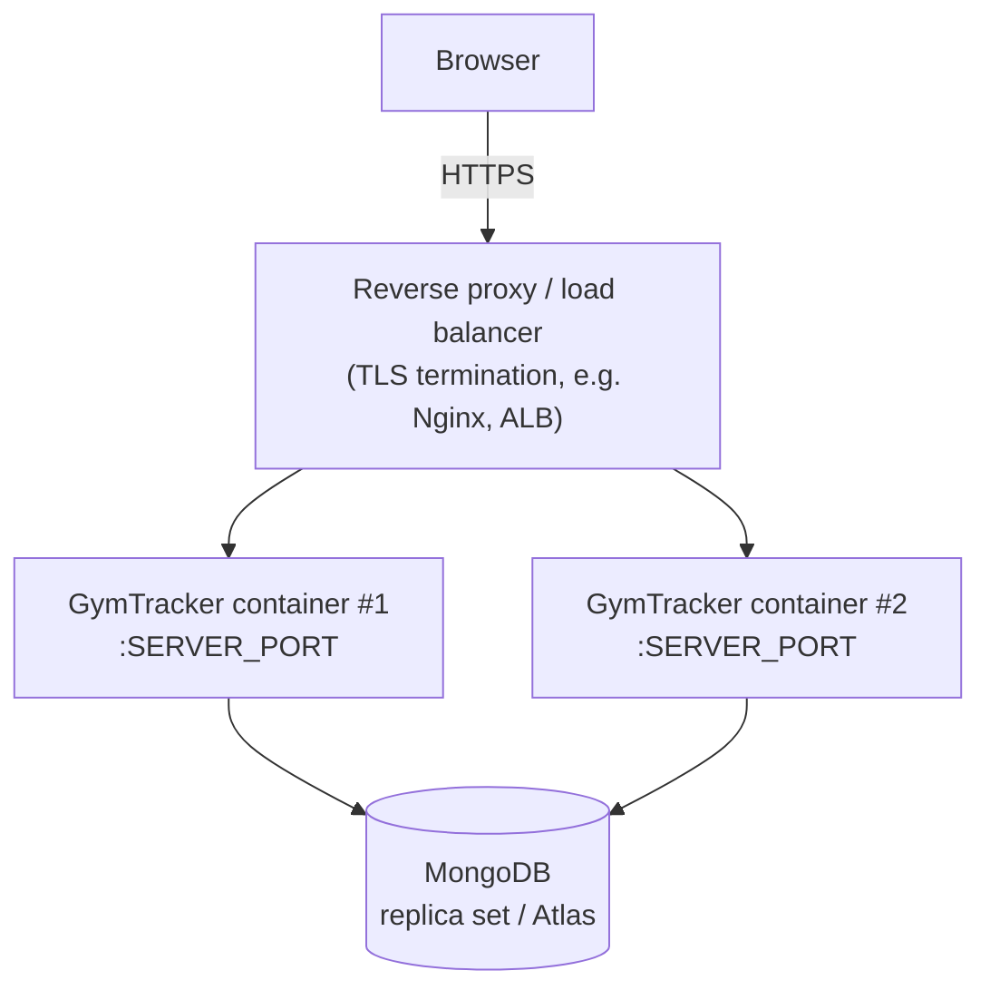

# Deployment

## Prerequisites

| Requirement | Version | Notes |
|---|---|---|
| Java | 21+ | matches `<java.version>` in `pom.xml`; the bundled `mvnw`/`mvnw.cmd` wrapper downloads Maven itself |
| MongoDB | any recent 5.x/6.x/7.x | reachable at the URI configured via `MONGODB_URI`/`spring.data.mongodb.uri` |
| Docker + Docker Compose | optional but recommended | runs the app **and** MongoDB together with one command |

There is no separate frontend build step to run manually — the `vaadin-maven-plugin` handles the production frontend bundle as part of the normal Maven build (this project has no custom npm dependencies, so Vaadin's default pre-built production bundle is used automatically; no Node.js is required at build or run time).

## Running locally (no Docker)

```bash
./mvnw spring-boot:run          # Windows: mvnw.cmd spring-boot:run
```

Opens on `http://localhost:8080`. The `dev` profile is active by default (browser auto-launches, devtools live-reload enabled). Stop with `Ctrl+C`.

```bash
./mvnw clean package -DskipTests
java -jar target/gymtracker-0.0.1-SNAPSHOT.jar
```

Omit `-DskipTests` to run the full test suite as part of the build (requires a local MongoDB reachable for the `@DataMongoTest` repository tests — see [DEVELOPER_GUIDE.md](DEVELOPER_GUIDE.md#testing)).

## Docker deployment

### Architecture





Both containers share an internal bridge network (`gymtracker-network`); `gymtracker-app` only starts once MongoDB's health check passes.

### Quick start

```bash
cp .env.example .env      # adjust values if needed
docker compose up -d
```

```bash
docker compose logs -f gymtracker-app   # follow app logs
docker compose ps                       # check health status of both containers
docker compose down                     # stop (keeps the mongodb_data volume)
docker compose down -v                  # stop and delete the mongodb_data volume
```

### Building/running the image directly (without Compose)

```bash
docker build -t gymtracker .
docker run -p 8080:8080 \
  -e MONGODB_URI="mongodb://<host>:27017/gymtracker" \
  -e SPRING_PROFILES_ACTIVE=prod \
  gymtracker
```

### Image size / build notes

- Multi-stage build: only the final jar is copied into the runtime image (`COPY --from=build --chown=gymtracker:gymtracker`); the JDK, Maven wrapper download, and the entire `~/.m2` dependency tree from the build stage never reach the final image.
- Runtime base is `eclipse-temurin:21-jre-alpine` (JRE only, Alpine Linux) — the smallest actively-maintained official Temurin variant; `curl` (a few MB) is added only because the container health check needs it (see below).
- `RUN --mount=type=cache,target=/root/.m2` on both Maven invocations in the build stage speeds up rebuilds without affecting the final image size — cache mounts are external to any image layer.
- The app runs as a non-root user (`gymtracker`) in the runtime image.

## Environment variables

All configuration is externalized to environment variables (never hardcoded), with local-development defaults baked into `src/main/resources/application.properties` via `${VAR:default}` placeholders. `.env.example` documents every variable Docker Compose uses; copy it to `.env` (gitignored, never commit real secrets) and adjust.

| Variable | Default | Used by | Purpose |
|---|---|---|---|
| `SERVER_PORT` | `8080` | app | HTTP port, both inside the container and the host port mapping |
| `SPRING_PROFILES_ACTIVE` | `prod` (Docker) / `dev` (local `mvnw spring-boot:run`) | app | Selects `application-dev.yml` or `application-prod.yml` overrides |
| `MONGODB_URI` | `mongodb://mongodb:27017/gymtracker` (Docker) / `mongodb://localhost:27017/gymtracker` (local) | app | Full MongoDB connection string (`spring.data.mongodb.uri`) |
| `MONGODB_DATABASE` | `gymtracker` | app + mongodb container | Database name (`spring.data.mongodb.database`, and `MONGO_INITDB_DATABASE` for the container) |
| `MONGODB_PORT` | `27017` | mongodb container | Host port the container's `27017` is published on (for local tools like Compass/`mongosh`) |
| `MONGODB_DATA_VOLUME` | `gymtracker-mongodb-data` | mongodb container | Named Docker volume used for persistence |
| `LOG_LEVEL` | `INFO` | app | `logging.level.root` and `logging.level.com.gymtracker` |
| `JWT_SECRET` | `change-me-in-production` | *(reserved)* | Not read by the application today — GymTracker uses session-based Spring Security, not JWT. Defined so token-based auth can be added later without another env-file round trip. |
| `JAVA_OPTS` | *(empty)* | Dockerfile `ENTRYPOINT` | Extra JVM flags (e.g. `-Xmx512m`), appended to `java $JAVA_OPTS -jar app.jar` |

`spring.data.mongodb.uri`'s Spring Boot relaxed-binding environment variable name, `SPRING_DATA_MONGODB_URI`, also still works and takes precedence over the `MONGODB_URI`-driven default if both are set — useful if you're integrating with tooling that already sets the standard Spring name.

## Spring configuration (dev vs. prod)

| File | Role |
|---|---|
| `application.properties` | Base configuration, env-var-driven with local-dev defaults: `server.port`, `spring.data.mongodb.uri`/`database`, `logging.level.*`, `spring.profiles.active` (defaults to `dev`) |
| `application-dev.yml` | Local-development overrides: `vaadin.launch-browser: true`, `spring.devtools.restart/livereload: enabled: true` |
| `application-prod.yml` | Container/production overrides: `vaadin.launch-browser: false` (would fail/warn harmlessly in a headless container anyway), devtools disabled |
| `src/test/resources/application.properties` | Test-only, hardcoded to a dedicated `gymtracker_test` database — deliberately **not** environment-driven, so tests are deterministic and never touch a dev/prod database |

The Dockerfile sets `ENV SPRING_PROFILES_ACTIVE=prod` as the image default; docker-compose.yml passes it through from `.env` so you can flip to `dev` inside a container if ever needed (e.g. to debug with devtools enabled in a container) without rebuilding the image.

> **Devtools note:** `spring-boot-devtools` (auto-restart/live-reload) is a `runtime`+`optional` dependency. It has no effect on a packaged/repackaged production jar regardless of profile; `application-prod.yml` disabling it explicitly is a documentation/clarity choice, not a functional requirement.

## MongoDB configuration

### Via Docker Compose (recommended for local/staging)

The `mongodb` service (`mongo:7.0`, official image) is fully configured in `docker-compose.yml`:

- **Persistence**: named volume `mongodb_data` mounted at `/data/db` — survives `docker compose down` (only removed with `docker compose down -v`).
- **Health check**: `mongosh --quiet --eval "db.adminCommand('ping')"`, checked every 10s; `gymtracker-app` will not start until this passes (`depends_on: condition: service_healthy`).
- **Network**: only reachable from `gymtracker-app` via the internal `gymtracker-network` bridge network by default; `MONGODB_PORT` additionally publishes it to the host for local inspection with Compass/`mongosh`.
- **No authentication** configured out of the box (matches the connection string the application uses, which carries no credentials) — see the production checklist below before exposing this beyond local/trusted networks.

### Standalone / external MongoDB (production)

Point `MONGODB_URI` (or `SPRING_DATA_MONGODB_URI`) at your production instance (self-hosted replica set, Atlas, etc.), including credentials if required:

```
MONGODB_URI=mongodb://<user>:<password>@<host>:<port>/<database>?authSource=admin
```

Indexes (`@Indexed`/`@CompoundIndex` — see [DATABASE.md](DATABASE.md#indexes)) are created automatically by Spring Data MongoDB on application startup; no manual migration step is required for a fresh database. For an existing database, verify with `db.<collection>.getIndexes()`.

## Production configuration checklist

- [ ] Set `MONGODB_URI` (or `SPRING_DATA_MONGODB_URI`) to a production MongoDB instance via environment variable/secret — never commit real credentials to `.env` or `application.properties`. `.env` is gitignored and dockerignored by default.
- [ ] Confirm `SPRING_PROFILES_ACTIVE=prod` (the Dockerfile default) so devtools/browser-launch stay off.
- [ ] Set `LOG_LEVEL` to `INFO` or `WARN` in production (the default `INFO` is reasonable; avoid `DEBUG`).
- [ ] Terminate TLS in front of the app (reverse proxy/load balancer); the app itself serves plain HTTP on `SERVER_PORT`.
- [ ] Decide on sticky sessions vs. an externalized session store if running more than one app instance — see [Deployment topology](#deployment-topology) below (authentication state lives in the HTTP session, not a stateless token).
- [ ] Provision the first user accounts directly in MongoDB — there is no self-service sign-up (see [DEVELOPER_GUIDE.md](DEVELOPER_GUIDE.md#creating-a-test-user); hash passwords with BCrypt before inserting, never plaintext).
- [ ] Take regular backups of the MongoDB database/volume — the application enforces logical deletion (deactivation) for historical data, but a backup is the only protection against accidental database-level data loss.
- [ ] Monitor application logs (`com.gymtracker` package) for `WARN`-level authorization rejections, which indicate either misconfigured assignments or attempted unauthorized access.
- [ ] If `JWT_SECRET` is ever wired up for real (it is currently unused — see [Environment variables](#environment-variables)), generate a long random value and treat it as a secret, never a default.

## Deployment topology



Because authentication state is stored in the **HTTP session** (not a stateless token), a multi-instance deployment needs either:
- **sticky sessions** at the load balancer (simplest — route each client to the same instance for the life of their session), or
- a **shared/externalized session store** (e.g. Spring Session backed by Redis or MongoDB) if you need session portability across instances — not configured out of the box in this project.

## Health checks

| Component | Mechanism | Notes |
|---|---|---|
| `mongodb` container | `mongosh --quiet --eval "db.adminCommand('ping')"` (Docker Compose `healthcheck`) | Built into the official `mongo:7.0` image, no extra config needed |
| `gymtracker-app` container | `curl -f http://localhost:$SERVER_PORT/login` (Docker Compose `healthcheck`) | Uses the already-public `/login` route (`SecurityConstants.PUBLIC_ROUTES`) — **no application code was added** to support this; `curl` is installed in the runtime image specifically to back this check |
| Application-level `/actuator/health` | **Not implemented** | No `spring-boot-starter-actuator` dependency. If you need a dedicated health endpoint for an external load balancer/orchestrator (beyond the Docker Compose checks above), add the actuator starter and expose the endpoints you need — this is not wired up today |

## Continuous integration

`.github/workflows/ci.yml` builds and tests the application on every push/PR (JDK 21, Maven cache, a real `mongo:7.0` service container for repository/integration tests) — see [DEVELOPER_GUIDE.md](DEVELOPER_GUIDE.md#continuous-integration) for the exact steps and how to reproduce them locally. CI does not currently build or push the Docker image; it verifies the Maven build only.
