# User Guide

GymTracker has three roles — **Athlete**, **Coach**, **Nutritionist** — each seeing a different navigation menu and a different set of screens. This guide walks through the workflows for each role. Screens shared by all roles (Dashboard, Alerts, Statistics, Reports, Settings, My Account) are documented once in [Shared screens](#shared-screens).

## Signing in

Open the app and go to `/login`. Enter your email and password and click **Login**. Accounts are created directly in the database by an administrator (there is no self-service sign-up) — if you don't have credentials, contact whoever manages your gym's GymTracker instance.

- A disabled account cannot sign in — you'll see a message asking you to contact your coach or administrator.
- Wrong email/password shows "Invalid email or password."
- Successful sign-in redirects to the shared **Dashboard** route (its content is tailored to your role).
- **Logout** is available from the header on every screen.

## Navigation by role

Every role always gets **Dashboard** first and **Alerts**, **Statistics**, **My Account**, **Settings** last, in that order. The role-specific block in between differs:

```mermaid
flowchart LR
    subgraph Athlete
        A1[Dashboard] --> A2[My Profile]
        A2 --> A3[My Mesocycle]
        A3 --> A4[Workouts]
        A4 --> A5[Workout History]
        A5 --> A6[Nutrition]
        A6 --> A7[Nutrition History]
        A7 --> A8[Reports]
        A8 --> A9[Alerts]
        A9 --> A10[Statistics]
        A10 --> A11[My Account]
        A11 --> A12[Settings]
    end
    subgraph Coach
        C1[Dashboard] --> C2[Athletes]
        C2 --> C3[Exercises]
        C3 --> C4[Mesocycles]
        C4 --> C5[Workout History]
        C5 --> C6[Nutrition Plans]
        C6 --> C7[Reports]
        C7 --> C8[Alerts]
        C8 --> C9[Statistics]
        C9 --> C10[My Account]
        C10 --> C11[Settings]
    end
    subgraph Nutritionist
        N1[Dashboard] --> N2[Nutrition Plans]
        N2 --> N3[Nutrition History]
        N3 --> N4[Athletes]
        N4 --> N5[Mesocycles]
        N5 --> N6[Workout History]
        N6 --> N7[Reports]
        N7 --> N8[Alerts]
        N8 --> N9[Statistics]
        N9 --> N10[My Account]
        N10 --> N11[Settings]
    end
```

Note: Coaches and Nutritionists always see **Mesocycles** and **Workout History** in the menu even though their access there is read-only (or search-based) rather than full CRUD — the restriction is enforced on the page itself, not by hiding the link.

## Athlete workflows

### My Profile (`athletes/profile`)

Your self-service biometric profile — weight, height and similar fields are editable; everything else (name, email, role) is read-only. This is a different screen from **My Account** (see [Shared screens](#shared-screens)), which handles your generic name/email, not biometrics.

### My Mesocycle (`mesocycles`)

Read-only view of the training program(s) your coach has built for you — duration, target RPE, and the week-by-week plan of training days and exercises (sets/reps/target weight/target RPE per exercise).

### Logging a workout (`workouts`)

1. Open **Workouts**, enter the Mesocycle ID for the program you're following, and click **Start Workout** — this creates an in-progress draft and swaps in the workout-session editor.
2. Add each exercise you complete, then add sets (weight, repetitions, RPE 1–10) for it.
3. Set the total session duration.
4. Click **Finish Workout** to save it, or **Cancel Workout** to discard the draft entirely (nothing is saved on cancel).

Finishing a workout automatically triggers, in the background: one-rep-max recalculation, fatigue recalculation, and alert checks (missed workout, performance drop, fatigue, nutrition-plan expiry, mesocycle completion) — you don't need to do anything else for these.

### Workout History (`workouts/history`)

Your full history of completed sessions (date, duration, total volume, estimated 1RM, status) with a details view per session.

### Nutrition (`nutrition`) and Nutrition History (`nutrition/history`)

Read-only view of the nutrition plan your nutritionist has assigned (goal, calorie/macro targets, date range) and your full plan history.

### Reports (`reports`)

You can generate a **Progress Report** for yourself (strength/volume/consistency/fatigue trend). Reports accumulate in a **session-only** list (they are not saved once you close the browser) — export any of them to PDF or XLSX from there.

## Coach workflows

### Reviewing your roster (`athletes`)

Lists the athletes assigned to you (i.e., athletes you have created at least one mesocycle for), with search/filter by name, status and age range. Opens a read-only detail dialog per athlete.

### Maintaining the exercise catalog (`exercises`)

You are the only role that can create, edit or deactivate exercises. Search/filter by type, difficulty, equipment, status. An exercise can't be deactivated while it's still used by an active mesocycle.

### Building a mesocycle (`mesocycles`)

1. Click **New Mesocycle**, pick an Athlete ID, set the duration (weeks), target RPE and notes, and a status (start as `DRAFT` or go straight to `ACTIVE`).
2. Use the weekly planner to add training days and, per day, add exercises with sets/reps/target weight/target RPE — exercises can be dragged and reordered between days.
3. Save. You can later **duplicate** a mesocycle (to start a new block from a previous one) or **archive** it (archived mesocycles can no longer be edited).

You can only create/edit/duplicate/archive mesocycles you created yourself — mesocycles created by other coaches are not visible to you as write targets.

### Reviewing workout history (`workouts/history`)

Search by date range, mesocycle ID or status to review sessions logged by your assigned athletes.

### Nutrition plans (`nutrition`)

Read-only for coaches — you can see the plans a nutritionist has assigned to your athletes, but only nutritionists can create/edit them.

### Alerts (`alerts`)

You are the only role that can **acknowledge** or **resolve** alerts (with a confirmation step for resolving). Filter by status, type, athlete and date. Alerts you resolve remain in history permanently — they cannot be deleted.

### Statistics (`statistics`)

You see your own aggregate roster statistics by default (weekly progress, high-fatigue-athlete count, etc.). To drill into one specific athlete's charts (volume/1RM/fatigue), enter that athlete's ID in the "View Athlete Charts" search box — you'll only see it if that athlete is assigned to you.

### Reports (`reports`)

You can generate Athlete, Coach, Progress, Workout-History and Mesocycle reports — most require an Athlete ID or Mesocycle ID (must be assigned/owned). Export from the report history list to PDF or XLSX.

## Nutritionist workflows

### Assigning a nutrition plan (`nutrition`)

1. Click **New Nutrition Plan**, pick an Athlete ID, set the Goal (Cutting/Maintenance/Bulking), calorie and macro (protein/carbs/fat) targets, start/end date, observations, and whether it's active.
2. Save. Creating or activating a plan automatically deactivates any other active plan for that same athlete — an athlete has at most one active plan at a time.
3. Edit or deactivate plans later from the same screen.

You can only manage plans you created yourself.

### Nutrition History (`nutrition/history`)

Search by athlete to review that athlete's full plan history (only athletes assigned to you).

### Athletes (`athletes`) and Mesocycles (`mesocycles`)

Read-only: view the roster of athletes assigned to you (i.e., athletes you've created a nutrition plan for) and their training mesocycles, for context.

### Alerts (`alerts`)

Read-only, and limited to nutrition-related alerts (e.g. expired nutrition plan) for athletes assigned to you.

### Statistics (`statistics`)

Nutrition-focused summary figures only (assigned athlete count, active plan count) — no training charts.

### Reports (`reports`)

You can generate a **Nutrition Report** for any athlete assigned to you.

## Shared screens

### Dashboard (`dashboard`)

Content is tailored to your role:
- **Athlete:** weekly training volume, current fatigue level, recovery score, completed sessions, estimated 1RM, active alert count, current mesocycle/nutrition plan summary.
- **Coach:** assigned athlete count, active mesocycle count, athletes with high fatigue, pending alerts, weekly sessions, performance trend, and quick actions ("View Athletes" / "Create Mesocycle").
- **Nutritionist:** assigned athlete count, active nutrition plan count, plans expiring soon, nutrition-related alerts, and quick actions ("View Athletes" / "Create Nutrition Plan").

### Alerts (`alerts`)

What you see and can do here depends on your role — see the role-specific sections above. Alert types include high/critical fatigue, missed workout, nutrition plan expired, mesocycle completed, and performance drop.

### Statistics (`statistics`)

See the role-specific sections above for what's shown. There is also a placeholder "exercise statistics" chart section on this page that is not yet backed by real data.

### Reports (`reports`)

Click **New Report**, choose a report type (the list is filtered to what your role may generate — see above), fill in a target Athlete ID or Mesocycle ID if required, and generate. Generated reports appear in a list on the same page — **this list is only kept for your current browser session** and is not saved once you log out or close the browser. Export any report to PDF or XLSX from its row.

### My Account (`profile`)

Generic self-service profile — editable first/last name, read-only email. (This is distinct from the Athlete-only **My Profile** screen, which handles biometric fields like weight/height.)

### Settings (`settings`)

- **Account** — overview of your account details.
- **Security** — change your password (requires your current password).
- **Preferences** — theme (Light/Dark/System), and notification checkboxes. Note: language selection and email/push notifications are placeholders in the current version — they don't yet change the UI language or send real notifications.
